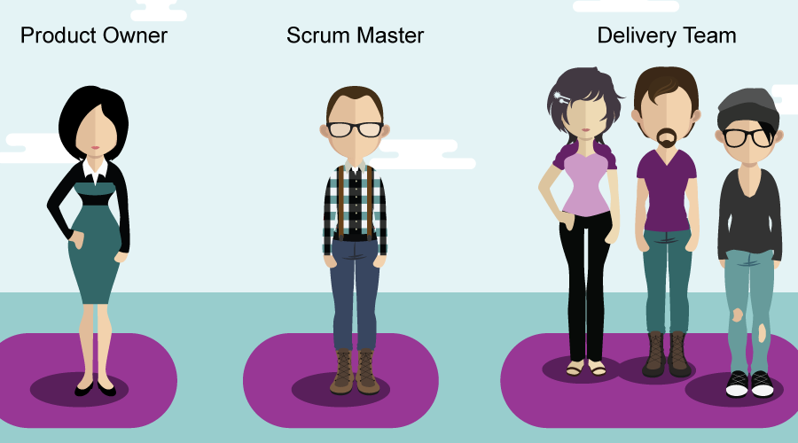

# Agile-Scrum

## Sommaire

I. [Les 12 principes du manifeste Agile](#i-les-12-principes-du-manifeste-agile)
   - [1. Prioriser la satisfaction du client](#1-prioriser-la-satisfaction-du-client)
   - [2. Accepter les changements](#2-accepter-les-changements)
   - [3. Livrer en permanence des versions opérationnelles de l’application](#3-livrer-en-permanence-des-versions-opérationnelles-de-lapplication)
   - [4. Assurer le plus souvent possible une coopération entre l’équipe du projet et les gens du métier](#4-assurer-le-plus-souvent-possible-une-coopération-entre-léquipe-du-projet-et-les-gens-du-métier)
   - [5. Construire les projets autour de personnes motivées](#5-construire-les-projets-autour-de-personnes-motivées)
   - [6. Favoriser le dialogue direct](#6-favoriser-le-dialogue-direct)
   - [7. Mesurer l’avancement du projet en fonction de l’opérationnalité du produit](#7-mesurer-lavancement-du-projet-en-fonction-de-lopérationnalité-du-produit)
   - [8. Adopter un rythme constant et soutenable par tous les intervenants du projet](#8-adopter-un-rythme-constant-et-soutenable-par-tous-les-intervenants-du-projet)
   - [9. Contrôler continuellement l’excellence de la conception et la bonne qualité technique](#9-contrôler-continuellement-lexcellence-de-la-conception-et-la-bonne-qualité-technique)
   - [10. Privilégier la simplicité en évitant le travail inutile](#10-privilégier-la-simplicité-en-évitant-le-travail-inutile)
   - [11. Auto-organiser et responsabiliser les équipes](#11-auto-organiser-et-responsabiliser-les-équipes)
   - [12. Améliorer régulièrement l’efficacité de l’équipe en ajustant son comportement](#12-améliorer-régulièrement-lefficacité-de-léquipe-en-ajustant-son-comportement)

     
II. [La méthode SCRUM](#ii-la-méthode-scrum)
   - [1. La Méthode Scrum : qui fait quoi ?](#1-la-méthode-scrum--qui-fait-quoi-)
   - [2. Les grandes étapes de la méthode SCRUM](#2-les-grandes-étapes-de-la-méthode-scrum)
        

# I. Les 12 principes du manifeste Agile

## 1. Prioriser la satisfaction du client

Ceci est le principe le plus important des méthodes agiles. Cela peut paraître évident mais ça ne l’est pas forcément. En effet, pour savoir si le client est satisfait il faut savoir l’impliquer dans le processus de développement, parce qu’après tout, dans un cycle en V de deux ans on cherche aussi à satisfaire un client, mais il n’est pas ou peu impliqué.

## 2. Accepter les changements

Ce principe est la définition même de l’agilité. Allégez les phases amont de conception et de définition du besoin, ceux-ci évolueront de toute façon au cours du projet, et organisez-vous pour accepter les changements sans que ce ne soit la panique à bord. Cela ne veut pas dire que l’on doive tout bouleverser à la moindre demande. Chaque imprévu doit être traité comme n’importe quelle autre fonctionnalité : on l’analyse, la chiffre, la priorise.

## 3. Livrer en permanence des versions opérationnelles de l’application

Découper le cycle de développement en sprints ne suffit pas, il faut que chaque sprint soit couronné d’une ou plusieurs livraisons de features fonctionnelles. S’il vous faut plusieurs sprints pour faire une livraison valide, allongez la durée de vos sprints. Si au contraire pendant un sprint vous avez fait 15 mises en production et couvert 3 sujets, raccourcissez-les. Dans le premier cas le client croira que vous avez du retard, dans le deuxième il sera débordé par la quantité de fonctionnalités à valider.

## 4. Assurer le plus souvent possible une coopération entre l’équipe du projet et les gens du métier

Parlez-vous ! Oubliez les mails froids du type « Voici les specs pour le prochain sprint, on se revoit dans deux semaines ». Ou le développeur qui dit à la fin du sprint « On a pas corrigé ce bug parce qu’on n’a pas réussi à la reproduire ». Echangez, clarifiez, demandez…

L’agencement des espaces de travail peut aider grandement quand métier et développement sont dans la même entreprise. Au lieu de regrouper tous les développeurs au même endroit (alors qu’ils ne travaillent pas forcément sur la même chose) et les gens du métier ailleurs, rassemblez les personnes en fonction des projets. Il faut toutefois éviter l’effet inverse : l’utilisateur qui va interpeller à tout bout de champ le premier développeur qu’il trouve pour lui remonter un bug ou faire une suggestion. Canalisez-les vers le Product Owner, il est là pour ça.

## 5. Construire les projets autour de personnes motivées

Une équipe agile doit être motivée pour réussir. Si c’est une erreur de considérer les gens comme des ressources interchangeables, c’est d’autant plus vrai en méthode agile. En effet, une équipe agile a besoin de temps pour se « rôder ». En Scrum par exemple, les tâches sont chiffrées en points qui ne correspondent à aucune valeur. Il faut quelques sprints pour que l’équipe arrive à déterminer combien de points elle est capable de produire, parce que les membres apprennent à se connaître, apprennent des erreurs et des succès des sprints précédents. Transférer les membres d’une équipe à l’autre brutalement peut casser cet équilibre.

## 6. Favoriser le dialogue direct

Parlez-vous ! Privilégiez l’oral, et limitez autant que possible l’écrit aux équipes éclatées géographiquement. Il n’y a rien de plus frustrant que de voir deux personnes dans la même pièce qui communiquent par Skype/Slack (sauf si c’est pour demander « Je peux venir te parler ?»).

## 7. Mesurer l’avancement du projet en fonction de l’opérationnalité du produit

Avec des méthodes telles que Scrum il est très facile de tout mesurer, de tout KPIser : points, burn-up/burn-down charts… C’est bien de produire de nombreux points mais cela ne suffit pas si ceux-ci reviennent sous la forme de bugs dans un ou deux sprints. Le but de chaque itération est de produire du logiciel qui fonctionne, idéalement dans les temps estimés, c’est la meilleure façon d’évaluer la performance d’une équipe.

## 8. Adopter un rythme constant et soutenable par tous les intervenants du projet

Si les méthodes agiles doivent vous faire tendre vers une plus grande adaptabilité, elles ne sont pas synonymes de chaos pour autant. Etre agile, ce n’est pas tout interrompre suite à une demande du client, faire travailler l’équipe toute la nuit et se féliciter ensuite d’avoir été réactif, c’est même tout le contraire ! Si une demande de changement doit provoquer de la friction et amener l’équipe à l’épuisement, c’est justement le signe que vous n’êtes pas agile. N’oubliez pas également que le client/Product Owner fait partie de l’équipe : produire des quantités de fonctionnalités que le PO n’a pas le temps de valider n’est pas un rythme soutenable.

## 9. Contrôler continuellement l’excellence de la conception et la bonne qualité technique

Agile ne doit pas vous faire abandonner la conception, sinon vous allez essayer d’assembler des bouts de code produits par différentes personnes et espérer que tout fonctionne. Ce qui est à bannir, c’est la phase de conception sur toutes les fonctionnalités du projet en amont. En tant que Scrum Master, demandez à vos équipes de faire de la conception avant de coder. En tant que Product Owner, demandez leurs d’écrire des specs détaillées pour s’assurer que l’histoire a été comprise. Le but n’est pas de produire de la documentation, cela peut être une liste dans un mail, un bout de pseudo-code ou même une discussion. Si vous travaillez en Scrum ou en Kanban, vous pouvez rajouter une colonne Conception sur le tableau, entre To Do et On Going. Toutes les cartes ne seront pas concernées. Un bug qui se corrige en une heure n’en aura pas forcément besoin tandis qu’une carte qui prendra une journée et plus devrait passer systématiquement par de la conception.

## 10. Privilégier la simplicité en évitant le travail inutile

Simplifiez au maximum. Si le projet ressemble à une montagne insurmontable, ne visez pas la fin mais seulement la première étape. Au besoin, divisez chaque étape autant qu’il le faudra pour que chaque tâche, chaque histoire paraisse simple.

## 11. Auto-organiser et responsabiliser les équipes

Vous aurez beau avoir les meilleurs talents, une équipe travaillant sous la contrainte sera toujours moins performante, laissez-les s’auto-organiser. Les personnes qui travaillent vers un but commun parce qu’elles le veulent seront toujours plus efficaces et plus fiables que des équipes travaillant ensemble parce qu’on leur a dit de le faire.

## 12. Améliorer régulièrement l’efficacité de l’équipe en ajustant son comportement

L’amélioration continue est un principe que l’on doit garder en tête quand on travaille en méthode agile. Pourtant, la rétrospective est généralement la réunion qui passe à la trappe : c’est à la fin du sprint, souvent le vendredi, les gens sont fatigués, n’en voient pas l’utilité… C’est une erreur car il n’est pas possible de s’améliorer en arrière. Ne négligez pas ce moment-là, c’est peut-être le plus enrichissant pour vos équipes.

 - - -

# [II. La méthode SCRUM]

Définition : L’approche SCRUM est une méthode agile consacrée à la gestion de projet.

Son objectif phare est **d’améliorer la productivité** des équipes, tout en permettant une **optimisation du produit** grâce à des feedbacks réguliers du marché.

> En parallèle, la méthode SCRUM permet d’avoir une vue d’ensemble du projet pour chacune des parties prenantes.

## 1. La Méthode Scrum : qui fait quoi ?

### Le rôle du Scrum Master : le gourou

Le Scrum Master est le guide de l'avancement du projet, celui qui s’assure que les principes et les valeurs du Scrum sont respectés. C’est le coordinateur des équipes qui vérifie que la communication est au top. Il améliore aussi la productivité et il lève les obstacles.

### Le rôle du Product Owner

‍Lui c’est l’expert qui collabore avec le client. Souvent le fondateur ou le boss.

- Il définit à la suite des feedbacks clients les spécificités fonctionnelles du produit.
- Il les priorise ensuite avec l’équipe.
- Il valide les fonctionnalités développées.
- Il endosse le rôle du client auprès de l’équipe.

### Et l’équipe justement ?

  
>‍ Elle est constituée des développeurs. Dans la méthode SCRUM, il n’est pas censé y avoir de hiérarchie entre eux, quand bien même leur savoir-faire et compétence seraient différents. Idéalement une équipe contient 6 à 10 personnes pour être la plus efficace possible.

## 2.Les grandes étapes de la méthode SCRUM

### Étape 1 : Le Product Backlog

Dans cette phase, le Product Owner rencontre le client et analyse son besoin. Il identifie toutes les fonctionnalités dont le produit devra être composé (les user stories) dans ce qui s’appelle le Product Backlog.

Ce “ cahier des charges “ n’est pas fixé pour toujours, et pourra évoluer en fonction des besoins du client et l'avancement du projet.L’équipe décide de ce qu’elle peut faire et dans quel ordre le faire.

### Étape 2 : Le sprint

‍La méthode SCRUM se caractérise par une répartition de chacune des tâches à faire. L’équipe trie les fonctionnalités et tâches qu’elle répartit dans des Sprint (durée de cycle de deux semaines).

Et pendant ce cycle, l’équipe s’occupera par exemple uniquement de coder une fonctionnalité du produit qu’elle devra livrer à la fin de cette phase.

> Le sprint planning meeting : on organise avant chaque sprint une réunion de planification.

C’est une sorte de négociation entre le product owner et l’équipe technique : le sprint planning meeting. Cette réunion permet de sélectionner dans le product backlog les exigences les plus prioritaires pour le client.

Le product owner propose des user stories. L’équipe technique analyse les user stories, les traduit en tâches techniques, et regarde en combien de temps chacune des user stories pourra être réalisée. Après négociation et décision concernant les choses à faire, les tâches constituent le sprint backlog.

#### **Le Daily SCRUM : la mêlée quotidienne***

Dans l’optique de respecter la méthode SCRUM, chaque matin, quand l’équipe est au complet on réalise le daily scrum : une réunion de 5–10 minutes, qui se fait debout (pour aller plus vite !) où l’on parle de trois choses :
- Ce qu’on a fait hier ?
- Quels problèmes on a rencontrés ?
- Que va-t-on faire aujourd’hui ?

Cette réunion permet de motiver et stimuler les équipes et sans cesse se reposer la question du sens de ses actions …

#### **Et concrètement : comment on s’organise dans le sprint ?**

Pour les ingrédients, vous pouvez vous équiper avant le sprint : d’un tableau velleda aimanté et de post-it de couleurs.

> Le tableau est divisé en trois colonnes : à faire, en cours, réalisé.

En début de sprint, on recense chacune des petites tâches qui seront nécessaires pour réaliser la fonctionnalité en question du produit. On représente chaque tâche par un post-it de couleur. Elles se trouvent dans la première colonne : à faire.

Au fur et à mesure qu’elles seront réalisées, elles seront bougées vers la droite. L’équipe a établi combien de temps prendrait chaque tâche. Il est ainsi facile de voir pendant un sprint si l’équipe tiendra ses timings et ces objectifs. Cela force à tendre vers l’efficacité plus que la perfection.

### Étape 3 : Sprint Review

Tous les vendredis qui closent un sprint on teste les bénéfices de la fonctionnalité avec le Product Owner.

On fait une démo de ce qui a été créé. Puis le destinataire de la fonctionnalité (le client par exemple) confirme ou non si la fonctionnalité marche comme il le souhaitait. La boucle est bouclée !
